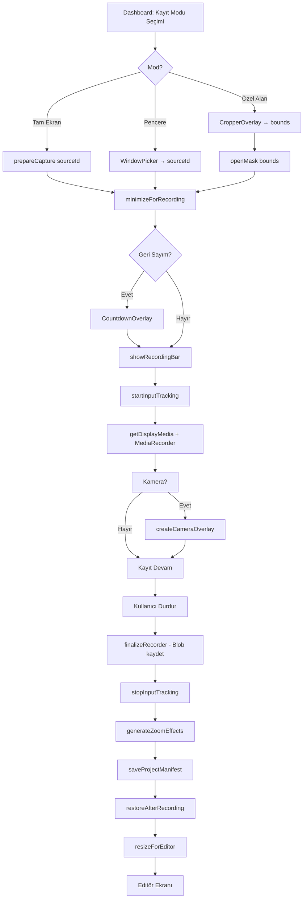
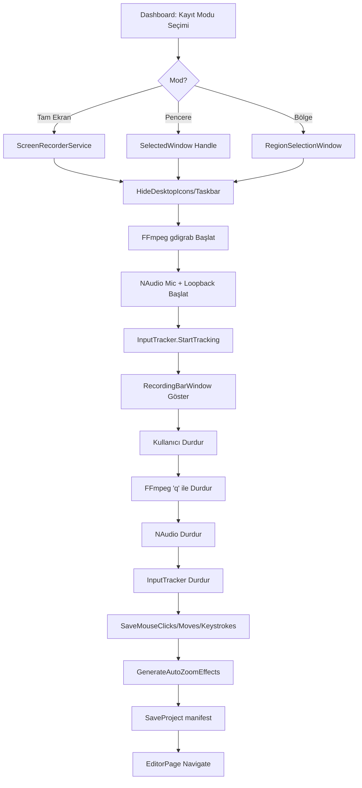

# ScreenPowerPro — Kapsamlı Proje Dokümantasyonu & Eksik Analizi

Electron.js (React/TypeScript) versiyonu ile .NET/C# (WinUI 3) versiyonu arasındaki detaylı karşılaştırma, eksik özellik analizi ve uygulama planı.

---

## 1. Proje Genel Bakış

### 1.1 Vizyon
Kullanıcıların ekran kayıtlarını alırken, arka planda klavye ve mouse hareketlerini kaydedip, post-processing aşamasında bu verilere dayanarak **otomatik zoom, pan ve imleç efektleri** uygulayan profesyonel bir masaüstü uygulaması.

### 1.2 Teknoloji Karşılaştırması

| Katman | Electron (Eski) | .NET / C# (Yeni) |
|--------|-----------------|-------------------|
| **Framework** | Electron.js | WinUI 3 (WinAppSDK 2.4) |
| **UI** | React + Tailwind CSS | XAML + Code-behind |
| **State Management** | Zustand (2 store) | CommunityToolkit.Mvvm (MVVM) |
| **Video İşleme** | fluent-ffmpeg + ffmpeg-static | FFmpeg CLI (harici binary) |
| **Input Tracking** | uiohook-napi (Node native) | Win32 Low-Level Hooks (P/Invoke) |
| **Ekran Kaydı** | WebRTC desktopCapturer + MediaRecorder | FFmpeg gdigrab |
| **Ses** | WebRTC getUserMedia + loopback | NAudio (WasapiLoopback + WaveIn) |
| **Paketleme** | electron-builder (NSIS/DMG) | MSIX / Unpackaged |
| **Platform** | Windows + macOS | Sadece Windows |

---

## 2. Modül Bazlı Karşılaştırma

### 2.1 Ekranlar (Views/Pages)

| Ekran | Electron Bileşeni | .NET Karşılığı | Durum |
|-------|-------------------|----------------|-------|
| Dashboard (Ana Ekran) | `Dashboard.tsx` (23KB) | `DashboardPage.xaml` (27KB) | ✅ Mevcut |
| Kütüphane | `Library.tsx` (6KB) | — | ❌ **EKSİK** |
| Video Editör | `EditorWorkspace.tsx` + 8 alt bileşen | `EditorPage.xaml` (49KB) | ⚠️ Kısmi |
| Export Ekranı | `ExportScreen.tsx` (6KB) | `ExportPage.xaml` (11KB) | ✅ Mevcut |
| Ayarlar Modal | `SettingsModal.tsx` (14KB) | `SettingsPage.xaml` (10KB) | ⚠️ Kısmi |
| Kayıt Barı | `RecordingBar.tsx` (14KB) | `RecordingBarWindow.xaml` (3KB) | ⚠️ Kısmi |
| Kamera Overlay | `CameraOverlay.tsx` (3KB) | — | ❌ **EKSİK** |
| Geri Sayım Overlay | `CountdownOverlay.tsx` (1KB) | — | ❌ **EKSİK** |
| Kırpıcı/Alan Seçici | `CropperOverlay.tsx` (8KB) | `RegionSelectionWindow.xaml` (2.4KB) | ⚠️ Kısmi |
| Maske Overlay | `MaskOverlay.tsx` (2KB) | — | ❌ **EKSİK** |
| Navigasyon | `SideNav.tsx` + `TopNav.tsx` (6KB) | MainWindow Title Bar | ⚠️ Kısmi |
| Pencere Seçici | `WindowPickerModal.tsx` (4KB) | Dashboard içinde ComboBox | ⚠️ Kısmi |

### 2.2 Servisler

| Servis | Electron | .NET | Durum |
|--------|----------|------|-------|
| Settings | `projectService.ts` load/save | `SettingsService.cs` | ✅ Mevcut |
| Project Management | `projectService.ts` (166 satır) | `ProjectService.cs` (139 satır) | ✅ Mevcut |
| Input Tracker | `inputTracker.ts` (uiohook) | `InputTrackerService.cs` (Win32 Hooks) | ✅ Mevcut |
| Screen Recorder | WebRTC MediaRecorder (useRecording.ts) | `ScreenRecorderService.cs` (FFmpeg gdigrab) | ✅ Farklı Mimari |
| Export | `exportService.ts` (fluent-ffmpeg) | `ExportService.cs` (FFmpeg CLI) | ✅ Mevcut |
| Zoom Engine | `zoomEngine.ts` (256 satır) | `InputTrackerService.GenerateAutoZoomEffects` (37 satır) | ⚠️ **ÇOK EKSİK** |
| Media Protocol | Custom "media://" protocol | — | ❌ **EKSİK** (gerek yok, doğrudan dosya yolu) |
| Window Manager | `windowManager.ts` (294 satır) | MainWindow.xaml.cs (69 satır) | ⚠️ **Çok Eksik** |

### 2.3 State Management

| Store | Electron (Zustand) | .NET (MVVM) | Durum |
|-------|-------------------|-------------|-------|
| AppStore | 91 satır — screen, settings, recording state, export progress | DashboardViewModel + SettingsViewModel | ⚠️ Dağınık |
| EditorStore | **396 satır** — timeline, zoom effects, tracks, undo/redo, cut, delete | EditorViewModel (144 satır) | ❌ **ÇOK EKSİK** |

---

## 3. Detaylı Eksik Özellik Analizi

### 🔴 KRİTİK EKSİKLER (İşlevselliği Doğrudan Etkiler)

#### 3.1 Zoom Engine — Keyframe Tabanlı Animasyon Sistemi
Electron'daki `zoomEngine.ts` dosyası 256 satırlık sofistike bir zoom motoru içerir:
- **Cluster-based keyframe generation**: Yakın tıklamalar gruplanıp tek bir zoom sezonu oluşturulur
- **Smooth zoom in/out timing**: `ZOOM_IN_TIME=0.8s`, `ZOOM_OUT_TIME=0.8s`, `HOLD_TIME=1.0s`
- **Pan between clicks**: Aynı cluster içindeki tıklamalar arası kaydırma (`PAN_TIME=0.6s`)
- **easeInOutCubic interpolation**: CSS benzeri yumuşak geçiş eğrisi
- **Real-time preview**: `getActiveZoomAtTime()` fonksiyonu editörde canlı önizleme sağlar

**.NET tarafında**: `GenerateAutoZoomEffects()` sadece 37 satır ve basit bir "her tıklamaya bir zoom" yaklaşımı kullanır. Clustering, keyframe interpolation ve real-time preview **yok**.

#### 3.2 Editor — Undo/Redo Sistemi
Electron'daki `editorStore.ts`:
- 50 adımlık geçmiş yığını (`MAX_HISTORY = 50`)
- Snapshot tabanlı undo/redo (zoom effects + tüm track state'leri)
- Mutation öncesi otomatik `pushHistory()` çağrısı

**.NET tarafında**: Undo/redo mekanizması **hiç yok**.

#### 3.3 Editor — Cut at Playhead (Klip Bölme)
Electron'da `splitClipsAtTime()` fonksiyonu:
- Video, mic ve system audio track'lerini playhead konumunda böler
- Zoom efektlerini de böler
- Bölünen kliplere yeni ID'ler atar

**.NET tarafında**: Klip bölme özelliği **hiç yok**.

#### 3.4 Editor — Track Sistemi (ClipSegment)
Electron'da her track (video, mic, sys) `ClipSegment[]` dizisi tutar:
- `sourceStart`, `sourceEnd`, `trackOffset` ile kaynak-timeline mapping
- Klip silme ve sonraki klipleri kaydırma (`removeClipById`)
- Track mute toggle
- Timeline üzerinde klip sürükleme

**.NET tarafında**: Track/Clip sistemi **hiç yok**. Sadece basit zoom efektleri listesi var.

#### 3.5 Kütüphane (Library) Ekranı
Electron'da `Library.tsx` — kayıtlı projeleri listeleme, açma, silme işlemleri.

**.NET tarafında**: Kütüphane ekranı **hiç yok**. Dashboard'da `RecentProjects` listesi var ama ayrı bir kütüphane ekranı yok.

#### 3.6 Kamera Overlay
Electron'da `CameraOverlay.tsx` — webcam görüntüsünü yuvarlak pencerede gösterme, sürüklenebilir overlay:
- Ayrı `BrowserWindow` olarak oluşturulur
- Aspect ratio kilitli
- Sürüklenebilir (60fps smooth dragging)
- Always on top

**.NET tarafında**: Kamera overlay **hiç yok**.

#### 3.7 Geri Sayım (Countdown) Overlay
Electron'da `CountdownOverlay.tsx` — kayıt başlamadan önce tam ekran yarı-saydam geri sayım:
- Ayrı pencere, mouse event'lerini yok sayar
- Büyük animasyonlu sayılar

**.NET tarafında**: Geri sayım overlay **hiç yok**. `CountdownSeconds` ayarı var ama görsel gösterim yok.

#### 3.8 Maske Overlay (Custom Region Recording)
Electron'da `MaskOverlay.tsx` — kayıt sırasında seçili alan dışını karartan overlay:
- Tam ekran yarı-saydam pencere
- Mouse event'lerini yok sayar
- Seçili alanı şeffaf gösterir

**.NET tarafında**: Maske overlay **hiç yok**.

### 🟡 ORTA ÖNCELİKLİ EKSİKLER

#### 3.9 Editör — Video Önizleme + Zoom Simulasyonu
Electron'daki `VideoPreview.tsx` (20KB):
- HTML `<video>` üzerinde CSS `transform: scale() translate()` ile zoom simülasyonu
- `getActiveZoomAtTime()` ile gerçek zamanlı zoom önizleme
- Seek bar, play/pause, tam süre gösterimi
- `seekVersion` sistemi ile timeline tıklamasında video seek

**.NET tarafında**: `EditorPage.xaml` içinde `MediaPlayerElement` var ama zoom preview **yok**.

#### 3.10 Editör — Timeline Bileşeni
Electron'daki `Timeline.tsx` (29KB):
- Video track, Mic track, System Audio track gösterimi
- Zoom efektleri "pill" şeklinde timeline üzerinde gösterilir
- Sürükle-bırak ile zoom efektlerinin zamanlamasını değiştirme
- Playhead çizgisi ve tıklama ile seek
- Zoom in/out kontrolü
- Zaman cetvel çizgisi (ruler)
- Klip seçme ve özellik düzenleme

**.NET tarafında**: Basit bir timeline var ama sürükle-bırak, zoom pills, track gösterimi **eksik**.

#### 3.11 Editör — PropertiesPanel
Electron'daki `PropertiesPanel.tsx` (22KB):
- Seçili zoom efektinin özelliklerini düzenleme (startTime, duration, scale, easing)
- İmleç ayarları (görünürlük, boyut, stil, tıklama efekti)
- Hareket bulanıklığı kontrolü
- Kamera ayarları (şekil, boyut, görünürlük)
- Ses kontrolleri (mikrofon/sistem ses seviyesi)
- Video hızı kontrolü
- Arkaplan rengi/opaklık ayarları
- Filigran (watermark) ayarları
- Kısayol tuşları gösterimi toggle

**.NET tarafında**: EditorPage içinde temel ayarlar var ama detaylı properties panel **çok eksik**.

#### 3.12 Editör — Toolbar
Electron'daki `EditorToolbar.tsx` (6.5KB):
- İmleç (Selection), Kes (Cut/Split), Sil araçları
- Undo/Redo butonları
- Zoom slider
- Play/Pause kontrolleri
- Zaman göstergesi

**.NET tarafında**: Temel toolbar mevcut ama cut/split, undo/redo butonları **eksik**.

#### 3.13 Ayarlar — Tam Özellik Seti
Electron'daki `SettingsModal.tsx` (14KB):
- **General Tab**: Proje kayıt lokasyonu, Export lokasyonu (folder picker dialog)
- **Record Tab**: Auto Zoom modu (none/smooth/instant), Masaüstü simgeleri gizle, Taskbar gizle, Çözünürlük, Geri sayım, İmleç gizle
- **Export Tab**: Format (MP4/WebM), FPS (30/60), Çözünürlük
- **Devices Tab**: Mikrofon seçimi, Kamera seçimi, Hoparlör seçimi

**.NET tarafında**: Temel ayarlar mevcut ama **tab yapısı yok**, cihaz seçimi **eksik**, AutoZoom modu boolean (smooth/instant farkı yok).

### 🟢 DÜŞÜK ÖNCELİKLİ EKSİKLER

#### 3.14 Video Debug Panel
Electron'da `VideoDebugPanel.tsx` — geliştirici hata ayıklama paneli.

#### 3.15 Audio Level Hooks
Electron'da `useAudioLevel.ts` ve `useSystemAudioLevel.ts` — gerçek zamanlı ses seviyesi gösterimi.

#### 3.16 Media Devices Hook
Electron'da `useMediaDevices.ts` — mikrofon/kamera cihaz listesi.

---

## 4. Model Farklılıkları

### AppSettings Karşılaştırması

| Alan | Electron | .NET | Durum |
|------|----------|------|-------|
| `projectLocation` | ✅ string | ✅ `ProjectSaveLocation` | ✅ |
| `exportLocation` | ✅ string | ✅ `ExportLocation` | ✅ |
| `autoZoom` | `'none' \| 'smooth' \| 'instant'` | `bool AutoZoom` | ⚠️ **Eksik**: Mod seçimi yok |
| `hideDesktopIcons` | ✅ bool | ✅ bool | ✅ |
| `hideTaskbar` | ✅ bool | ✅ bool | ✅ |
| `hideMouseCursor` | ✅ bool | ✅ bool | ✅ |
| `resolution` | `'1080p' \| '4k'` | ✅ string | ✅ |
| `countdown` | `0 \| 3 \| 5 \| 10` | ✅ int | ✅ |
| `exportFormat` | `'mp4' \| 'webm'` | ✅ string | ✅ |
| `exportFps` | ✅ number | ✅ int (`Fps`) | ✅ |
| `exportResolution` | `'720p' \| '1080p' \| '4k'` | — | ❌ **Eksik** |
| `microphoneEnabled` | ✅ bool | ✅ `MicAudioEnabled` | ✅ |
| `systemAudioEnabled` | ✅ bool | ✅ bool | ✅ |
| `cameraEnabled` | ✅ bool | ✅ bool | ✅ |
| `selectedCameraId` | ✅ string | ✅ `SelectedCameraDevice` | ✅ |
| `selectedMicId` | ✅ string | ✅ `SelectedMicDevice` | ✅ |
| `selectedSpeakerId` | ✅ string | — | ❌ **Eksik** |
| `customCropBounds` | ✅ object | — | ❌ **Eksik** |
| `excludeAppFromRecording` | — | ✅ bool | ✅ (.NET'e özgü) |

### TimelineSettings Karşılaştırması

| Alan | Electron | .NET | Durum |
|------|----------|------|-------|
| `cursorSmoothing` | ✅ | ✅ | ✅ |
| `motionBlur` | ✅ | ✅ | ✅ |
| `watermark` | ✅ | ✅ | ✅ |
| `showShortcutKeys` | ✅ | ✅ `ShowKeystrokes` | ✅ |
| `canvasBackground` | ✅ | — | ❌ **Eksik** |
| `backgroundOpacity` | ✅ | — | ❌ **Eksik** |
| `defaultZoomScale` | ✅ | — | ❌ **Eksik** |
| `motionBlurAmount` | ✅ | — | ❌ **Eksik** |
| `videoSpeed` | ✅ | — | ❌ **Eksik** |
| `cursorSize` | ✅ | — | ❌ **Eksik** |
| `cursorVisible` | ✅ | — | ❌ **Eksik** |
| `cursorStyle` | ✅ | — | ❌ **Eksik** |
| `clickEffect` | ✅ | — | ❌ **Eksik** |
| `cursorClickSound` | ✅ | — | ❌ **Eksik** |
| `hideCursorWhenIdle` | ✅ | — | ❌ **Eksik** |
| `cameraVisible` | ✅ | — | ❌ **Eksik** |
| `cameraShape` | ✅ | — | ❌ **Eksik** |
| `cameraSize` | ✅ | — | ❌ **Eksik** |
| `micVolume` | ✅ | — | ❌ **Eksik** |
| `sysVolume` | ✅ | — | ❌ **Eksik** |
| `watermarkText` | ✅ | — | ❌ **Eksik** |
| `aspectRatio` | — | ✅ `AspectRatio` | ✅ (.NET'e özgü) |
| `backgroundStyle` | — | ✅ `BackgroundStyle` | ✅ (.NET'e özgü) |

---

## 5. Proje Dosya Yapısı Karşılaştırması

### Electron Proje Yapısı
```
_electron_backup/
├── electron/                        # Ana süreç (Main Process)
│   ├── main.ts                      # Uygulama giriş noktası, media:// protokolü
│   ├── preload.ts                   # IPC bridge (electronAPI)
│   ├── ipcHandlers.ts               # Tüm IPC komutları (337 satır)
│   ├── windowManager.ts             # Pencere yönetimi (294 satır)
│   └── services/
│       ├── projectService.ts        # Proje CRUD (166 satır)
│       ├── inputTracker.ts          # Mouse/Keyboard hooks (106 satır)
│       └── exportService.ts         # FFmpeg render (124 satır)
├── src/                             # Renderer Process (React)
│   ├── App.tsx                      # Route yönetimi
│   ├── components/
│   │   ├── dashboard/Dashboard.tsx  # Ana ekran (23KB)
│   │   ├── library/Library.tsx      # Kütüphane (6KB)
│   │   ├── editor/
│   │   │   ├── EditorWorkspace.tsx   # Editör layout
│   │   │   ├── EditorTopBar.tsx      # Üst bar
│   │   │   ├── EditorToolbar.tsx     # Araç çubuğu
│   │   │   ├── EditorSidebar.tsx     # Sol menü
│   │   │   ├── PropertiesPanel.tsx   # Özellikler paneli (22KB)
│   │   │   ├── VideoPreview.tsx      # Video + Zoom preview (20KB)
│   │   │   ├── Timeline.tsx          # Timeline (29KB)
│   │   │   └── VideoDebugPanel.tsx   # Debug panel
│   │   ├── export/ExportScreen.tsx   # Export ekranı
│   │   ├── settings/SettingsModal.tsx # Ayarlar (14KB)
│   │   ├── recording/
│   │   │   ├── RecordingBar.tsx       # Kayıt barı (14KB)
│   │   │   ├── CameraOverlay.tsx      # Webcam overlay
│   │   │   ├── CountdownOverlay.tsx   # Geri sayım
│   │   │   ├── CropperOverlay.tsx     # Alan seçici (8KB)
│   │   │   ├── MaskOverlay.tsx        # Maske overlay
│   │   │   └── WindowPickerModal.tsx  # Pencere seçici
│   │   └── layout/
│   │       ├── SideNav.tsx            # Sol navigasyon
│   │       └── TopNav.tsx             # Üst navigasyon
│   ├── stores/
│   │   ├── appStore.ts               # Genel state (91 satır)
│   │   └── editorStore.ts            # Editör state (396 satır)
│   ├── hooks/
│   │   ├── useRecording.ts           # Kayıt hook (337 satır)
│   │   ├── useAudioLevel.ts          # Ses seviyesi
│   │   ├── useSystemAudioLevel.ts    # Sistem sesi seviyesi
│   │   └── useMediaDevices.ts        # Cihaz listesi
│   ├── lib/
│   │   ├── zoomEngine.ts             # Zoom motoru (256 satır)
│   │   ├── recordingUtils.ts         # Kayıt yardımcıları
│   │   └── videoDebug.ts             # Debug yardımcıları
│   └── types/index.ts                # TypeScript tipler
└── shared/types/index.ts             # Ortak tipler (171 satır)
```

### .NET Proje Yapısı
```
ScreenPowerPro/
├── App.xaml                          # Design system renkleri
├── App.xaml.cs                       # DI container
├── MainWindow.xaml                   # Ana pencere + Frame
├── MainWindow.xaml.cs                # Navigasyon (69 satır)
├── Models/
│   ├── AppSettings.cs                # Uygulama ayarları
│   ├── InputEvents.cs                # Mouse/Keyboard event modelleri
│   └── ProjectManifest.cs            # Proje manifesto + ZoomEffect + TimelineSettings
├── Services/
│   ├── SettingsService.cs            # Ayar yükleme/kaydetme
│   ├── ProjectService.cs             # Proje CRUD + proje listesi
│   ├── InputTrackerService.cs        # Win32 Low-Level Hooks
│   ├── ScreenRecorderService.cs      # FFmpeg gdigrab + NAudio
│   └── ExportService.cs              # FFmpeg render
├── ViewModels/
│   ├── DashboardViewModel.cs         # Dashboard state + kayıt başlatma
│   ├── RecordingBarViewModel.cs      # Kayıt barı state
│   ├── EditorViewModel.cs            # Editör state (basit)
│   ├── ExportViewModel.cs            # Export state + progress
│   └── SettingsViewModel.cs          # Ayarlar state
├── Views/
│   ├── DashboardPage.xaml(.cs)       # Ana ekran
│   ├── EditorPage.xaml(.cs)          # Video editör
│   ├── ExportPage.xaml(.cs)          # Export ekranı
│   ├── SettingsPage.xaml(.cs)        # Ayarlar sayfası
│   ├── RecordingBarWindow.xaml(.cs)   # Kayıt barı penceresi
│   └── RegionSelectionWindow.xaml(.cs) # Alan seçici
└── Helpers/
    ├── FFmpegHelper.cs               # FFmpeg path bulma + render komutu
    └── Win32Helper.cs                # P/Invoke: hooks, taskbar, desktop icons
```

---

## 6. Uygulama Planı (Öncelik Sırasına Göre)

### Faz 1 — Kritik Eksikler (Temel İşlevsellik)

> [!IMPORTANT]
> Bu eksikler uygulamanın temel özelliklerini doğrudan etkiler.

#### 1.1 Zoom Engine Yeniden Yazımı
- [ZoomEngineService.cs](file:///c:/Users/burak/ScreenPowerPro/ScreenPowerPro/Services) — Electron'daki `zoomEngine.ts`'in C# portu
  - `GenerateZoomEffectsFromClicks()` — AutoZoom modu destekli (none/smooth/instant)
  - `BuildKeyframes()` — Cluster tabanlı keyframe oluşturma
  - `GetActiveZoomAtTime()` — Gerçek zamanlı zoom preview interpolasyonu
  - `EaseInOutCubic()` — Yumuşak geçiş eğrisi
  - `BuildZoompanFilter()` — FFmpeg filtreleri için doğru zoom ifadesi oluşturma
  - `FormatTimecode()` — Zaman gösterimi

#### 1.2 EditorViewModel Genişletme
- Track sistemi ekleme (`ClipSegment`, `TrackState`)
- Undo/Redo sistemi (50 adımlık snapshot geçmişi)
- `CutAtPlayhead()` — playhead konumunda klip bölme
- `DeleteSelected()` — seçili klip/zoom silme
- `ToggleMute()` — track sessiz/sesli
- SeekVersion mekanizması

#### 1.3 AppSettings AutoZoom Modu
- `bool AutoZoom` → `string AutoZoomMode` ("none" / "smooth" / "instant")
- Buna bağlı UI güncellemesi

#### 1.4 TimelineSettings Eksik Alanları
- `CanvasBackground`, `BackgroundOpacity`, `DefaultZoomScale`, `MotionBlurAmount`
- `VideoSpeed`, `CursorSize`, `CursorVisible`, `CursorStyle`, `ClickEffect`
- `CursorClickSound`, `HideCursorWhenIdle`
- `CameraVisible`, `CameraShape`, `CameraSize`
- `MicVolume`, `SysVolume`, `WatermarkText`

---

### Faz 2 — Orta Öncelikli Eksikler (Kullanıcı Deneyimi)

#### 2.1 Kütüphane (Library) Sayfası
- `LibraryPage.xaml` — kayıtlı projeleri grid/liste görünümünde listeleme
- Proje açma, silme, klasörde gösterme
- Son kullanılan projelere hızlı erişim

#### 2.2 Kamera Overlay Penceresi
- Yeni `CameraOverlayWindow` — webcam yuvarlak pencere
- Always on top, sürüklenebilir
- Aspect ratio kilitli
- MediaCapture API ile webcam akışı

#### 2.3 Geri Sayım Overlay
- Yeni `CountdownWindow` — tam ekran yarı-saydam
- Animasyonlu büyük sayılar (3, 2, 1)
- Mouse event'lerini geçir (click-through)

#### 2.4 Maske Overlay
- `MaskOverlayWindow` — özel alan kaydında alan dışını karartan overlay
- Şeffaf delikli tam ekran pencere
- Mouse event geçirme (click-through)

#### 2.5 Editör Video Preview — Zoom Simulasyonu
- `MediaPlayerElement` üzerine `RenderTransform` (ScaleTransform + TranslateTransform) ile zoom simulasyonu
- Timer tabanlı `getActiveZoomAtTime()` çağrısı ile real-time preview

#### 2.6 Editör Timeline — Gelişmiş Özellikler
- Zoom efektleri pill gösterimi
- Sürükle-bırak ile zamanlama değiştirme
- Playhead sürükleme
- Track mute ikonları
- Zaman cetveli (ruler)

#### 2.7 Editör Properties Panel Genişletme
- İmleç ayarları (boyut, stil, tıklama efekti)
- Kamera ayarları (şekil, boyut)
- Ses kontrolleri (mikrofon/sistem ses seviyesi slider)
- Video hız kontrolü
- Arkaplan ayarları
- Filigran ayarları

---

### Faz 3 — Düşük Öncelikli İyileştirmeler

#### 3.1 Ayarlar — Tab Yapısı ve Cihaz Seçimi
- General, Record, Export, Devices tab'ları
- Mikrofon/Kamera/Hoparlör dropdown listesi
- Cihaz canlı ses seviyesi göstergesi

#### 3.2 Pencere Boyutu Yönetimi
- Dashboard modunda küçük pencere (720x350)
- Editör modunda büyük pencere (1200x800)
- Kayıt sırasında pencereyi gizleme/gösterme

#### 3.3 Video Debug Panel (Geliştirici için)

---

## 7. Kayıt Akışı Karşılaştırması

### Electron Kayıt Akışı


### .NET Kayıt Akışı


> [!WARNING]
> .NET akışında **geri sayım**, **maske overlay**, **kamera overlay** adımları eksik. Ayrıca kayıt sonrası otomatik editör pencere boyutu ayarlaması yapılmıyor.

---

## 8. Tasarım Sistemi — Obsidian Flux Dark

.NET'teki `App.xaml` dosyasında tasarım sistemi renkleri doğru şekilde tanımlanmış:

| Token | Hex | Kullanım |
|-------|-----|----------|
| `AppBgColor` | `#12131A` | Ana arkaplan |
| `SurfaceContainerColor` | `#1E1F27` | Kart/panel arkaplanı |
| `PrimaryColor` | `#C0C1FF` | Ana vurgu (Periwinkle) |
| `PrimaryContainerColor` | `#8083FF` | Buton arkaplanları |
| `TertiaryColor` | `#D0BCFF` | İkincil vurgu (Soft Purple) |
| `SecondaryColor` | `#FFB2B7` | Kayıt göstergesi (Soft Pink) |
| `TextPrimaryColor` | `#E3E1EC` | Ana metin |
| `TextMutedColor` | `#908FA0` | Soluk metin |
| `RecordRedStart` | `#DC2626` | Kayıt butonu gradient |

> [!TIP]
> Renk sistemi doğru uygulanmış. Tasarım dosyaları `stitch_prostudio_screen_recorder/` altında HTML mockup'lar olarak mevcut.

---

## 9. Bilinen Hatalar / Sorunlar (.NET Projesi)

> [!CAUTION]
> Aşağıdaki potansiyel sorunlar tespit edilmiştir:

1. **`RecordingBarViewModel.VideoPath`**: Manifest'e kaydedilen `VideoPath` tam yol olarak set ediliyor (`Path.Combine(_activeProjectDir, "recording", "display-0.mp4")`). Electron'da göreceli yol kullanılıyor (`"./recording/display-0.mp4"`). Bu, proje taşınabilirliğini bozar.

2. **`FFmpegHelper.BuildRenderCommand`**: Zoom ifadelerinde `\\,` escape'leri kullanılıyor ama FFmpeg CLI'da bunlar gereksiz olabilir — test edilmeli.

3. **`InputTrackerService`**: Win32 hook'lar UI thread'inde çalışıyor. Yoğun mouse hareketlerinde UI donması olabilir. `STA` thread veya message pump gerekebilir.

4. **`ScreenRecorderService.StopRecordingAsync`**: FFmpeg'e `q` yazarak durduruyor ama `StandardInput.WriteLine("q")` bazen çalışmayabilir — `\n` yerine sadece `q` karakteri gerekir.

5. **NAudio `WaveIn` deprecated uyarısı**: `#pragma warning disable CS0618` ile bastırılmış. `WaveInEvent` kullanılabilir.

6. **Proje açıldığında video dosyası bulunamazsa** crash olabilir — null kontrolleri eksik.

---

## Open Questions

> [!IMPORTANT]
> Aşağıdaki soruların cevapları uygulama planını etkileyecektir:

1. **Öncelik sırası**: Yukarıdaki 3 fazdan hangisi ile başlanmasını tercih ediyorsunuz? Tüm fazları mı yoksa sadece belirli özellikleri mi istiyorsunuz?

2. **macOS desteği**: .NET versiyonu sadece Windows hedefliyor. macOS desteği gerekli mi? (Electron'da vardı)

3. **Build & Test**: Projeyi `dotnet build` ile derleyebiliyor musunuz? Mevcut hatalar neler?

4. **FFmpeg**: FFmpeg sisteminizde yüklü mü? Yolu nedir?

5. **Tasarım referansı**: `stitch_prostudio_screen_recorder/` altındaki HTML mockup'lar ile .NET arayüzünün uyumu ne seviyede? Özellikle editör ekranı tasarımı doğrudan HTML'den mi uyarlanmalı?

---

## Verification Plan

### Automated Tests
- `dotnet build` — derleme hataları kontrolü
- Birim testleri yazılabilir: `ZoomEngineService`, `FFmpegHelper`, `ProjectService`

### Manual Verification
- Uygulama çalıştırma ve tüm ekranlar arası gezinme
- Kayıt başlatma/durdurma testi
- Editörde zoom efekti ekleme/silme
- Export işlemi testi
- Tasarım tutarlılığı kontrolü (HTML mockup'lar ile karşılaştırma)
